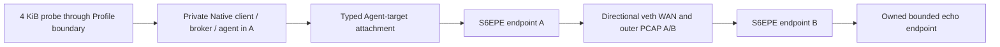

# Shadow6 WAN / PCAP Test Lab

This guide is bilingual. The Test Lab consumes the Native Profile Registry and
the existing Native config generators and Named Service lifecycle. It does not define another
Core list or normalize Core wire protocols. Reports always name the Core,
Profile, native transport, application boundary, adapter, and carrier.

## English

### Fetch a successful Actions artifact without compiling Cores

Authenticate the GitHub CLI, then ask the Test Lab to fetch the most recent
successful `multiplatform.yml` run on the repository's default branch. The
fetcher verifies the completed run, workflow artifact name, source commit,
available GitHub artifact digest, zip bounds, safe archive paths, Profile
contract digests, and every available binary SHA-256. A successful older run
that predates the per-file manifest is still bound to GitHub's run/commit and
download digest; the report shows that per-file provenance was unavailable.

```sh
python3 Test-Lab/shadow6_test_lab.py --fetch-artifacts --check
python3 Test-Lab/shadow6_test_lab.py --fetch-artifacts --all-profiles \
  --scenario clean --scenario good-wan --scenario high-jitter \
  --scenario failure-recovery --capture --payload-bytes 4096 --requests 2
```

Use `--run-id RUN_ID`, `--commit FULL_SHA`, or `--tag TAG` to pin a source. To
consume an artifact directory downloaded by another workflow, use
`--artifacts-dir PATH`. `--check` is read-only and prints all twelve primary
Cores plus every registered Profile. `--all-cores` executes each Core's
primary Profile; `--all-profiles` also executes the additional Gleam
micro-mux Profile. `--core` and `--profile` narrow a debugging run.

The runner creates temporary Named Services through the existing setup, lock,
run, status and connection APIs. Binary and config material are locked before
launch, and structured readiness, owned endpoints and RuntimeObservation are
required before attaching. The deterministic 4 KiB logical payload is compared
byte for byte, with sent/received lengths and SHA-256 recorded. Message Profiles
use whole records bounded by the Profile max_record, including the real
seqpacket-fd attachment; stream Profiles use the registered TCP boundary.
Each measured goodput result is accepted only after payload correctness passes.
Failure/recovery schedules latency-only baseline, degraded and restored phases
after the worker emits its structured workload-ready event. Twelve bounded
probes span the phases while preserving the exact echo contract for best-effort
datagram profiles. RTT excludes explicit test pacing, whose value is reported
separately. This does not prove loss recovery, reconnect or migration.

### Simulated network and PCAP

```sh
python3 Test-Lab/shadow6_test_lab.py --list-scenarios
python3 Test-Lab/shadow6_test_lab.py --fetch-artifacts --all-cores \
  --scenario clean --scenario good-wan --scenario high-jitter \
  --scenario failure-recovery --capture
python3 Test-Lab/fingerprint_cli.py capture.pcap --run-id RUN_ID \
  --core go --profile go-kcp --link-type native --scenario good-wan \
  --output flow.json
```

The runner checks Linux `ip`/`tc` (including standard sbin locations),
`CAP_NET_ADMIN`, `CAP_SYS_ADMIN` and capture `CAP_NET_RAW`. The directional runner
requires tc even for clean, because it observes a zero-impairment qdisc. Run with explicit operator-provided sudo privileges
when the current process lacks these capabilities. Downloaded artifacts must be
owned by the execution identity or root before feature admission. Namespace
workers drop to the checkout owner after namespace entry. A namespace-local
dummy interface provides Native address discovery/ICE candidates with no host
uplink; its routes exist only inside the owned namespace. Simulated
Both Native and S6EPE WAN runs use `NamespacePair`: A contains the complete private Native
trio and its Agent-target attachment; B contains the carrier server and bounded
echo target. The Native baseline has an explicit stream/record Agent-target
forwarder across veth; the S6EPE matrix substitutes the formal carrier chain.
Each veth egress has its own qdisc, with kernel JSON observations
for A→B and B→A. Private Core sockets are not impaired by those qdiscs.
Failure-recovery uses bounded latency-only baseline, degraded
and restored phases so best-effort datagram profiles can still meet the exact
echo contract; it does not claim loss recovery or reconnect. These results are explicitly **simulated**, never real-WAN
measurements. When namespace capability is missing, the affected rows are
`BLOCKED` with the detected reason; a requested capture never falls back to
capturing a host interface.

PCAP uses `tcpdump` if installed, records interface/namespace/time/run/Core/
Profile/scenario metadata, and caps each file at 4 MiB. `tshark`, Zeek and
nDPI are optional observers; missing tools are reported. Unknown traffic stays
`unknown/custom`. The leak scanner reports hashes for explicit forbidden
fixtures and does not echo the fixture contents. No private key, bearer token,
or native configuration is included in the CI Test Lab artifact.

The fingerprint schema is `shadow6.wan-pcap-fingerprint.v1`. It reports
observable flow tuples, packet and byte counts, packet-size distributions,
directionality, timing/bursts, conservative handshake observations, and leak
scan status. It does not infer DPI resistance, concealment, security defects,
or protocol identity from IP/port differences.

### Artifact-backed CI bundle

After producer jobs finish, the `Platform/architecture artifact bundle` job
downloads same-run `shadow6-*` artifacts and publishes `shadow6-artifacts-all`.
The ZIP contains `platforms/<platform>/<architecture>/` groups, each with an
`artifacts.tar.gz`, a self-contained `manifest.json`, `README.md`, `install.sh`,
`install.ps1`, and the shared bounded installer helper. Each group can be
copied out and still verify its source commit, payload digest, and every
contained file digest before installing or staging it. Linux x86_64 runs the existing prebuilt release
installer when the full release tar is present. Android uses `adb install -r`
on a connected, already-authorized device. Component-only groups are staged in
the current user's local artifact directory; they do not enable services,
install packages, or change firewall/routes. `manifest.json` binds file hashes
to the workflow run and source commit; `SHA256SUMS` covers the overall ZIP.

The Linux `native-test-lab` job downloads the same-run Linux release artifact
and runs every registered Native Profile with bounded correctness, simulated
WAN, PCAP and fingerprint analysis. It never recompiles the Core binaries.
Environment capability failures are reported as `BLOCKED` and fail CI. No-loss
application failures also fail CI. Nonzero-loss measurements keep their actual
application `FAIL` rows; CI still requires bounded PCAP, flow ownership,
classification and leak evidence. A missing requested PCAP cannot produce PASS.
Ordinary PR execution uses no public VPS.

### S6EPE, real WAN and Android limits

The Test Lab executes sixteen authority-derived Core/Profile/Carrier bindings
using distinct raw, TLS1.3 mTLS, Linux SCTP and libdatachannel WebRTC adapters.
The release S6EPE binary must declare structured listener/session readiness;
WebRTC additionally requires the same-release `shadow6-lab-webrtc-peer` and
provider library. The component runtime passport binds workflow/run/attempt,
commit, platform/architecture and each runtime file's size/mode/SHA. Only verified
Actions 0644→0755 restoration is accepted. Older releases remain `BLOCKED` with
the detected reason. Idris's executable Chez image modes are reconciled against
the byte-identical same-run runtime tar, including when the launcher was already
present in the Core release.

Placement is **after the real Native Agent application target**. The worker
uses the Profile's actual TCP, seqpacket or UDP ApplicationBoundary and locked
Named Service lifecycle. Stream/datagram and record/stream Lab attachments are
explicit, bounded, ordered echo-workload facades; they do not claim production
adapter availability or native Core wire camouflage. SCTP sends/receives real
messages with EOR, stream and PPID checks. WebRTC uses the production S6SG1,
ICE/DTLS/DataChannel and independent authenticated S6EPE session implementation;
outer/native signalling legs are isolated and require fresh v6 active-session
metrics plus process-owned UDP sockets.



```sh
sudo python3 Test-Lab/shadow6_test_lab.py --s6epe-only --all-profiles \
  --artifacts-dir RELEASE_DIR --scenario clean --scenario good-wan \
  --scenario high-jitter --scenario failure-recovery --payload-bytes 4096 --requests 2
```

Outer PCAP is mandatory on both owned veth interfaces, with inner loopback
comparisons on both sides. A PASS needs structured readiness, exact application
length/hash/bytes, carrier byte accounting, process identity/socket ownership,
directional impairment observations, PCAP analysis and forbidden-literal scan.
Report v2 keeps each stage and scenario independent. Known marker absence does
not imply DPI resistance. `tls-record-observed` is not browser indistinguishability;
DataChannel runtime evidence is not browser indistinguishability or censorship resistance.

Remote SSH/VPS orchestration, remote PCAP, NAT observation, and grouped
Detector adversarial train/test experiments remain unavailable in this runner.
The directional veth suite is a real execution of simulated WAN impairment;
physical cross-host/Internet WAN execution remains unavailable. Do not put
endpoint credentials in command-line arguments or reports.

Android builds its 13 Profile descriptors directly from
`Crosed/native_profiles.py`; the app lists all twelve Native Cores and marks
the artifact/runtime binding available for the four currently packaged Core
engines. In a Client Profile, **Connect Core** waits for the Core's structured
`shadow6.ready` event. **Run 4 KiB application echo correctness probe** sends
bounded bytes through the local Client ApplicationBoundary and verifies exact
echo bytes and SHA-256; configure the remote Agent target as a controlled echo
service first. Copying the Android Test Lab JSON reports Profile, transport,
boundary, readiness and explicit capability limits, and excludes configuration
secrets. Device-side PCAP, the desktop supervisor, S6EPE, S6SG1 and desktop LLM
Lifecycle remain `unavailable`; the app does not add a shared platform ABI or
embed the Python Control Center.

## 中文

### 从 Actions 取预编译产物，不重新编译 Core

先让 GitHub CLI 登录，再运行以下命令。下载器默认查找默认分支上最新
成功的 `multiplatform.yml`，校验已完成的 workflow run、artifact 名称、源提交、
GitHub 可提供的 artifact digest、ZIP 边界与安全路径、Profile 合同摘要和每个可用
二进制的 SHA-256。早于逐文件 manifest 的成功 Actions 产物仍会与 GitHub run/commit
及下载 ZIP digest 绑定，但报告会指出逐文件 provenance 当时不可用。

```sh
python3 Test-Lab/shadow6_test_lab.py --fetch-artifacts --check
python3 Test-Lab/shadow6_test_lab.py --fetch-artifacts --all-profiles \
  --scenario clean --scenario good-wan --scenario high-jitter \
  --scenario failure-recovery --capture --payload-bytes 4096 --requests 2
```

可用 `--run-id RUN_ID`、`--commit FULL_SHA` 或 `--tag TAG` 固定来源；已有下载目录用
`--artifacts-dir PATH`。`--check` 只读显示十二个 Native Core 和全部注册 Profile。
`--all-cores` 跑每个 Core 的主 Profile；`--all-profiles` 还会跑 Gleam micro-mux。
调试时用 `--core` 或 `--profile` 缩小矩阵。

当前 runner 复用 Named Service 的 setup、lock、run、status 和 connection API，先锁定
binary/config，再要求结构化 readiness、归属正确的 endpoint 与 RuntimeObservation。
确定性 4 KiB 逻辑 payload 检查逐字节一致性、长度和发送/接收 SHA-256。message Profile
按 max_record 分段，真正使用声明的 seqpacket-fd 或 UDP record 边界；stream 使用 TCP
边界。failure/recovery 在 workload-ready 后施加 latency-only baseline、退化和恢复阶段，
用 12 次有界 probe 跨越三个阶段，以便 best-effort datagram 仍可验证 exact echo。RTT 不含
单独记录的 pacing；不声称验证了丢包恢复、reconnect 或 migration。

### 模拟网络和抓包

```sh
python3 Test-Lab/shadow6_test_lab.py --list-scenarios
python3 Test-Lab/shadow6_test_lab.py --fetch-artifacts --all-cores \
  --scenario clean --scenario good-wan --scenario high-jitter \
  --scenario failure-recovery --capture
python3 Test-Lab/fingerprint_cli.py capture.pcap --run-id RUN_ID \
  --core go --profile go-kcp --link-type native --scenario good-wan \
  --output flow.json
```

runner 会在 PATH 和标准 sbin 目录检测 `ip`/`tc`，并检查 `CAP_NET_ADMIN`、`CAP_SYS_ADMIN`
和抓包所需的 `CAP_NET_RAW`。directional runner 的 clean 也需 tc，以观测零 impairment qdisc；
需要时由操作者显式使用 sudo。
进入 namespace 后，worker 降权为 checkout owner。dummy 地址和路由只存在于该隔离
namespace，不连接主机 uplink。13×9 Native runner 与 S6EPE runner 都使用双 namespace/veth：
A 运行完整私有 Core trio 和 Agent-target attachment，B 运行受控应用端点。
Native baseline 的 stream/record target forwarder 和 S6EPE 正式 carrier 链分别实际经过 veth。
两个 veth
egress 分别施加 A→B/B→A qdisc，并记录内核 JSON 观测；不会施加在私有 Core 路径上。
报告明确标为 **simulated**，不能当作真实公网
WAN。缺少 namespace 能力的项目记为带具体原因的 `BLOCKED`；PCAP 请求不会退回抓取主机网卡。

若系统有 `tcpdump`，runner 会抓包，并把 interface、namespace、时间、run/Core/Profile 与
scenario 写入 sidecar metadata；每份 PCAP 上限 4 MiB。`tshark`、Zeek 与 nDPI 都是可选观察器，
缺失时明确报告。未识别的协议保留为 `unknown/custom`。泄漏扫描器可对禁止明文 fixture
报告摘要，但不会把 fixture 内容回显。CI Test Lab artifact 不含私钥、bearer token 或 native
配置。

fingerprint schema 为 `shadow6.wan-pcap-fingerprint.v1`，输出 flow tuple、包/字节数、长度分布、
方向、时间间隔/burst、保守握手观察和 leak scan 状态。不从 IP/端口不同推断协议，也不推断
DPI resistance、隐蔽性、安全缺陷或协议身份。

### CI 平台/架构总包

所有产物 job 汇合后，`Platform/architecture artifact bundle` 会下载同一 run 的 `shadow6-*`
artifacts 并上传 `shadow6-artifacts-all`。总 ZIP 按
`platforms/<platform>/<architecture>/` 分目录，每目录含 `artifacts.tar.gz`、自己的 `manifest.json`、
`README.md`、`install.sh`、`install.ps1` 和共享的有界安装 helper。单独提取的目录也能校验
run/commit、payload digest 与逐文件 SHA。若有完整 Linux x86_64 release tar，会
调用现有免编译预编译安装器；Android 目录通过 `adb install -r` 安装到已连接且已授权设备。
仅组件目录会暂存到当前用户目录，不会启服务、装系统包或改防火墙/路由。`manifest.json`
绑定工作流 run、源 commit 和各文件 hash；`SHA256SUMS` 校验外层总 ZIP。

Linux `native-test-lab` job 会下载同一 run 的 Linux release artifact，以有界正确性、模拟 WAN、
PCAP 与 fingerprint 对所有注册 Native Profile 测试，不重新编译 Core。`BLOCKED` 会令 job
失败；clean、lan、high-jitter、failure-recovery 中的 application `FAIL` 也会令 job 失败。
good-wan、mobile、long-haul、lossy、constrained 包含非零丢包，报告保留其实际 application
`FAIL`，不改成 PASS。所有 scenario 仍须通过 PCAP 与 flow ownership 校验；S6EPE 还须通过
wire classification 和 forbidden-literal scan，证据不完整会令 job 失败。普通 PR 不依赖公网 VPS。

### S6EPE、真实 WAN 和 Android 边界

Test Lab 目前复用 `Control-Center/privacy_envelope.py` 的 compatibility 源码，生成合法的
S6EPE Core/Profile/Carrier 行。runner 使用四个独立 carrier adapter 执行全部 16 条组合，
要求同次 release 的 S6EPE structured readiness；WebRTC 还需同次 release 的 Lab peer 和
libdatachannel。旧 artifact 缺少这些声明时明确 BLOCKED。

接线位置是实际 Native Agent 的应用出口：Core 三角色留在 A 的私有路径，Profile 的
TCP/seqpacket/UDP 应用语义由既有 Named Service 负责。Lab 的 stream↔datagram、
record↔stream attachment 保留有界 exact echo 和 record 边界，并明确不宣称生产 adapter
能力或 Native Core wire camouflage。SCTP 使用真实 message endpoint、EOR/PPID/channel
校验；WebRTC 使用真实 S6SG1、ICE/DTLS/DataChannel 和独立 S6EPE 认证会话，隔离 E/N leg，
核对 fresh v6 active session 与 owned UDP socket。

双端 outer veth PCAP 是 PASS 的必备证据，同时输出双端 inner loopback 对照。报告 v2
分别展示 source-legal、artifact、runtime、correctness、WAN、PCAP、wire、leak 与最终状态，
并核对进程身份、socket/flow 归属和业务字节计数。known-marker absence 不推导 DPI resistance。
跨主机/公网 WAN、远端 SSH/PCAP、Android device orchestration 仍不可用。
`standard-tls13` 不代表与浏览器 TLS 无法区分；`standard-webrtc-datachannel` 不代表浏览器
无法区分、anti-DPI 或 censorship resistance。

SSH/VPS 远程编排、远程抓包、NAT observation、按 capture/run 分组的数据集 split Detector
实验也尚未接入。不要把凭据放进命令行或提交到仓库。未来真实 WAN 必须显式启用，并标记
操作员提供的 endpoint/region/network-kind；netns 模拟不能替代这些实测。

Android APK 的 13 个 Profile 描述符由 `Crosed/native_profiles.py` 直接生成。界面显示全部
十二 Core，并把当前 APK 实际打包且存在 controller 的四个 Core 标为可运行。在 Client Profile
按下 **Connect Core** 后，应用等待 Core 输出结构化 `shadow6.ready`。**运行 4 KiB 应用回显正确性
探测**会经本机 Client ApplicationBoundary 发送有界数据，核验回显字节与 SHA-256；请先把远端
Agent target 配置为受控 echo service。复制的 Android Test Lab JSON 会记录 Profile、transport、
boundary、readiness 与能力限制，不包含配置秘密。设备侧 PCAP、桌面 supervisor、S6EPE、S6SG1
和桌面 LLM Lifecycle 明确为 `unavailable`；Android 不增加统一平台 ABI，也不内嵌 Python
Control Center。
